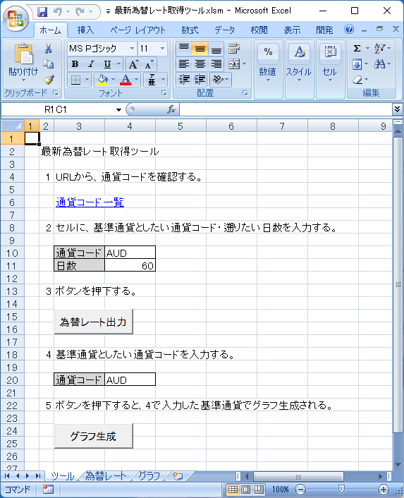
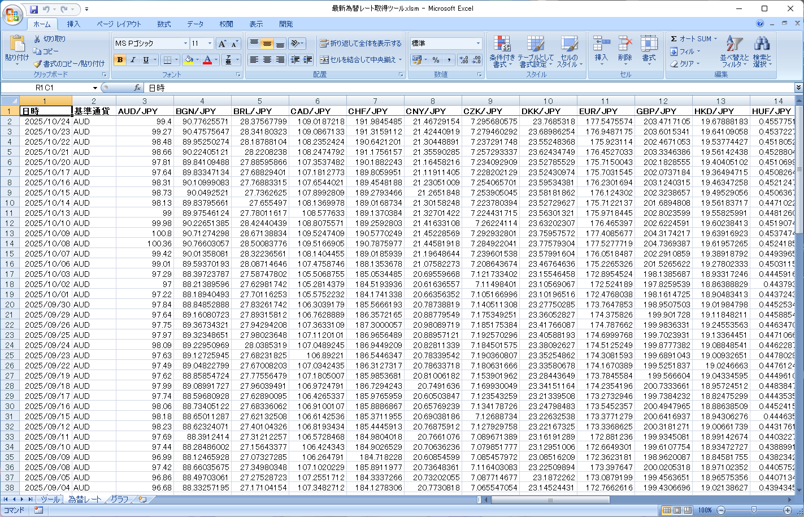
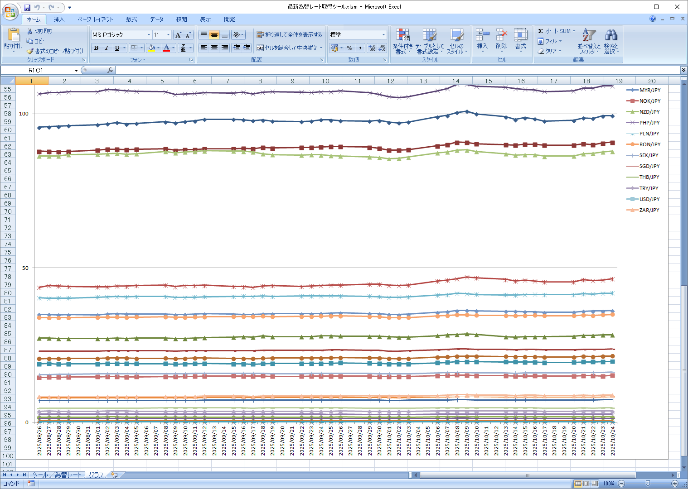

# VBA製 為替レート取得ツール (VBA Forex Tracker)

`vba-forex-tracker`は、無料の為替レートAPIである[Frankfurter API](https://www.frankfurter.app/)を利用して、最新の為替レートを取得し、Excelシートに記録・グラフ化するツールです。

## 概要

このツールは、Excel VBAを使用して、指定した基準通貨と日数に基づき、過去の為替レートデータを自動で取得します。取得したデータは、日付、基準通貨、および各通貨の対日本円（JPY）レートとして「為替レート」シートに整理・保存されます。さらに、特定の基準通貨のレート推移を折れ線グラフで視覚的に確認することも可能です。

## 主な機能

- **為替レートの一括取得**: 基準通貨と取得したい日数を指定するだけで、過去のデータをまとめて取得します。
- **自動データ記録**: 取得したデータは整形され、「為替レート」シートに自動的に追記・保存されます。
- **グラフ自動生成**: 指定した基準通貨の為替レート推移を、ボタン一つで折れ線グラフとして生成します。

## 動作要件

- Microsoft Excel for Windows (32-bit / 64-bit)
- インターネット接続
- マクロの有効化

### VBAの参照設定

本ツールは、APIとの通信およびJSONデータの解析のために、以下のライブラリを参照しています。ツールが正常に動作しない場合は、以下の手順で参照設定を確認・追加してください。

1.  Excelで `Alt + F11` キーを押し、VBAエディタ（VBE）を開きます。
2.  メニューバーから `ツール(T)` > `参照設定(R)...` を選択します。
3.  以下の2つにチェックが入っていることを確認します。もしなければ、一覧から探してチェックを入れてください。
    -   `Microsoft XML, v6.0`
    -   `Microsoft Scripting Runtime`

## 利用方法

### 1. 為替レートの取得

1.  **「ツール」シート**を開きます。
2.  セル **D10** に、基準としたい**通貨コード**（例: `AUD`）を入力します。
    -   利用可能な通貨コードは、[通貨コード一覧](https://api.frankfurter.app/currencies)のリンクから確認できます。
3.  セル **D11** に、遡って取得したい**日数**（例: `60`）を入力します。
4.  **[為替レート出力]** ボタンをクリックします。
    -   処理が開始され、ステータスバーに進捗が表示されます。完了するとメッセージが表示されます。

### 2. 取得データの確認

-   処理が完了すると、**「為替レート」シート**にデータが日付の降順で記録されます。

### 3. グラフの生成

1.  **「ツール」シート**に戻ります。
2.  セル **D20** に、グラフ化したい**基準通貨のコード**（例: `AUD`）を入力します。
    -   この通貨コードは、「為替レート」シートにデータが存在するものに限ります。
3.  **[グラフ生成]** ボタンをクリックします。
4.  **「グラフ」シート**に切り替わり、指定した通貨の全期間における為替レートの推移グラフが自動で生成されます。

## 依存関係

- **API**: [Frankfurter API](https://www.frankfurter.app/)
- **JSON Parser**: [VBA-JSON (v2.3.1)](https://github.com/VBA-tools/VBA-JSON)
    -   本ツールには、`JsonConverter.bas`モジュールとして組み込まれています。

## ライセンス

This project is licensed under the MIT License.

## 作者

[qack-dev](https://github.com/qack-dev)
